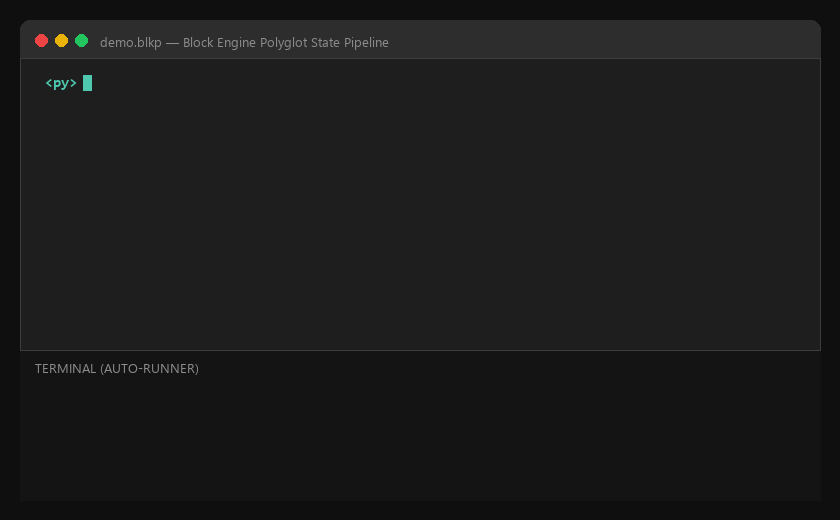

# Block Language

[](https://github.com/O-O1112/Block_lang/actions/workflows/ci.yml)
[](https://github.com/O-O1112/Block_lang/tags)
[](LICENSE)

**One file. Every runtime.** Block is a local-first polyglot programming engine for composing Python, JavaScript, Lua, PHP, SQLite, and more in one readable program with a shared state pipeline.

**Start here:** [download the engine](downloads.html) · [read the documentation](wiki.html) · [run the examples](examples/) · [report an external result](docs/THIRD-PARTY-VALIDATION.md) · [browse the source on GitHub](https://github.com/O-O1112/Block_lang)

Maintainers can use the [organic growth playbook](docs/GROWTH.md) to turn demos, releases, and user feedback into a repeatable discovery-to-install funnel.

## Why Block?

Block is for developers who already have useful code in more than one ecosystem and want a small, inspectable entry point instead of a collection of glue scripts. It does not replace Python, JavaScript, PowerShell, Rust, or any other mature language; it coordinates them.

<p align="center">
  
</p>

Previously, when you wanted a Python snippet to feed directly into JavaScript, you usually had to:

* Create multiple files;
* Handle inputs and outputs across different languages;
* Manually serialize data;
* Stitch them together using shell scripts, temporary files, or extra import workflows.

Block simplifies this entire process into a single file:

```block
<py>
total = 40 + 2
print("Python produced:", total)
</py>

<js>
console.log("JavaScript received:", total)
</js>

<html>
<p>Total: {{total}}</p>
</html>
```

Each language block retains its native syntax; Block manages block separation, sequential execution, serializable state passing, and handing results off to subsequent blocks.

For a five-minute tour, start with [`examples/README.md`](examples/README.md). It contains copy-ready programs for a first polyglot pipeline, a local data workflow, and native Block control flow.

---

## Getting Started in 1 Minute

Create a file named `hello.blk`:

```block
<py>
name = "Block"
number = 6 * 7
print(f"Hello, {name}!")
print("Answer:", number)
</py>
```

Run it:

```powershell
block hello.blk
```

Block detects the `<py>` block and delegates execution to your local Python environment. Please note that the corresponding runtime must be pre-installed on your system.

---

## File Formats and Editions

| Edition | Extension | Best For |
| --- | --- | --- |
| Lite | `.blkl` | Lightweight, local polyglot scripts |
| Standard | `.blk` | General development, modules, and local packages |
| Plus | `.blkp` | Standard features plus extra runtimes, servers, formatting, linting, and documentation tools |

Executable commands typically correspond to:

```text
block-lite  example.blkl
block        example.blk
block-plus   example.blkp
```

Available languages and capabilities vary depending on your installed edition, operating system, and local runtimes.

---

## Core Syntax: Language Blocks

### Basic Format

```block
<language>
Native code for the language
</language>
```

Python example:

```block
<py>
message = "hello"
print(message)
</py>
```

JavaScript example:

```block
<js>
const message = "hello from JavaScript";
console.log(message);
</js>
```

Opening and closing tags must match. Always use explicit closing tags (e.g., `</py>`, `</js>`) without omitting the slash.

### Common Language Tags

| Tag | Language |
| --- | --- |
| `<py>` | Python |
| `<js>` | JavaScript / Node.js |
| `<php>` | PHP |
| `<ruby>` or `<rb>` | Ruby |
| `<lua>` | Lua |
| `<ps>` | PowerShell |
| `<sql>` | SQL |
| `<html>` | HTML output |
| `<json>` | JSON output |
| `<c>`, `<cpp>` | C / C++ |
| `<go>` | Go |
| `<rust>` | Rust |
| `<ts>` | TypeScript |
| `<cs>` | C# |
| `<kotlin>` | Kotlin |
| `<dart>` | Dart |
| `<zig>` | Zig |
| `<perl>` | Perl |
| `<r>` | R |

Supported tags differ across editions. Plus supports custom runtime definitions, though the underlying runtime must be installed.

---

## Shared State: The Core Power of Block

Block transfers serializable values between blocks. The most reliably supported types across languages are:

* Integers and floating-point numbers
* Strings
* Booleans
* Arrays / Lists
* Objects / Dictionaries

```block
<py>
user = {
    "name": "Ada",
    "score": 98,
    "tags": ["math", "logic"]
}
</py>

<js>
console.log(user.name);
console.log(user.tags.join(", "));
user.score = user.score + 1;
</js>

<json>
{
  "user": {{user}}
}
</json>
```

State-sharing operates on these principles:

1. The preceding executable block produces values.
2. Block serializes and stores these values into the active execution state.
3. The next block receives these values upon startup.
4. Any modifications made by the block propagate to downstream blocks.

Avoid placing open file handles, sockets, database connections, functions, or circular references into the shared state, as they cannot be serialized across process boundaries.

---

## HTML and JSON Output

### HTML Templating

Use `{{variable}}` inside `<html>` to inject state values:

```block
<py>
title = "Block Dashboard"
count = 42
</py>

<html>
<!doctype html>
<html lang="en">
  <body>
    <h1>{{title}}</h1>
    <p>Items: {{count}}</p>
  </body>
</html>
</html>
```

Standard variables are automatically HTML-escaped during insertion to prevent arbitrary markup injection.

### JSON Output

```block
<py>
status = "ok"
items = ["python", "javascript", "html"]
</py>

<json>
{
  "status": "{{status}}",
  "items": {{items}}
}
</json>
```

`<html>` produces HTML output, whereas `<json>` yields structured JSON. Ensure the final interpolated output represents valid JSON when injecting raw objects or arrays.

---

## Importing External Block Files

Standard and Plus editions support local module imports:

```block
<import src="modules/common.blk" />
```

`src` specifies a relative path from the current script. Imported files can contain arbitrary language blocks and are evaluated inline at the point of import.

Directory layout:

```text
my-project/
├─ main.blk
└─ modules/
   └─ common.blk
```

`modules/common.blk`:

```block
<py>
shared_message = "loaded from common module"
</py>
```

`main.blk`:

```block
<import src="modules/common.blk" />

<py>
print(shared_message)
</py>
```

Imports are governed by sandboxed directories, file count limits, file size caps, and recursion depth limits. Directory traversal via `../` outside the project root and circular imports are blocked.

---

## Block Ecosystem and Packages

Initialize a project:

```powershell
block ecosystem init . my-project
```

Directory structure created:

```text
my-project/
├─ block.project.json
├─ main.blk
└─ packages/
```

Add a local package:

```powershell
block ecosystem add .\hello-block .
block ecosystem list .
```

Use the package:

```block
<use package="hello-block" />
```

Specify a custom entry point:

```block
<use package="hello-block" entry="src/main.blk" />
```

Basic `block.package.json`:

```json
{
  "name": "hello-block",
  "version": "1.0.0",
  "main": "main.blk",
  "description": "A reusable Block package"
}
```

Block ecosystem commands are local-first: adding a package reorganizes local directories without downloading or executing untrusted code. Package contents enter the execution pipeline only when explicitly invoked via script tags.

---

## Local Server

Standard and Plus editions can declare local HTTP servers using `<server>`:

```block
<server port="8080">
  <route path="/hello">
    <py>
    message = "hello from Block server"
    </py>
    <json>
    {
      "message": "{{message}}"
    }
    </json>
  </route>
</server>
```

Start the server:

```powershell
block server.blk
```

The server listens on:

```text
http://localhost:8080/
```

Route requests require an `X-Api-Token` header by default, printed to the console at startup. This built-in server is designed for local development and should not be exposed to public networks without additional security controls.

Serving static directories in Plus:

```block
<server port="8080">
  <static path="/assets" dir="public" />
</server>
```

---

## Custom Runtimes in Plus

Plus allows defining custom runtime tags:

```block
<define lang="deno" cmd="deno run" ext=".ts" />

<deno>
console.log("Hello from a custom runtime")
</deno>
```

Because this spawns external processes, it is subject to security policy checks. Enable it only when you trust the script contents, command definition, and host environment.

---

## Security Model

Block adopts a local-first, conservative security design:

* File imports are strictly restricted to designated sandbox directories.
* Circular imports and deeply nested import chains are rejected.
* APIs and local servers bind to `localhost` by default.
* API endpoints require `X-Api-Token` verification.
* An optional network guard can block scripts from initiating outbound network connections.
* Each block enforces strict execution timeouts.
* Request concurrency, input sizes, and output payloads are capped by upper limits.
* Certificates (`.pfx`), passwords, and private keys should never be committed into Block projects.

Security configurations do not replace rigorous code review. Never execute untrusted `.blk`, `.blkl`, or `.blkp` files, as language blocks invoke host runtimes directly.

---

## Common Pitfalls

### 1. Mismatched Tags

Incorrect:

```block
<py>
print("hello")
</js>
```

Correct:

```block
<py>
print("hello")
</py>
```

### 2. Missing Host Runtimes

Block acts as an orchestrator and does not bundle language runtimes. Ensure Python is available in your shell for `<py>`, Node.js for `<js>`, and so forth.

### 3. Non-Serializable State

Pass primitive strings, numbers, booleans, arrays, or objects across blocks. Avoid passing open file pointers, live connections, or function handles.

### 4. Code Outside Blocks

Executable logic must reside inside explicit tags like `<py>...</py>` or `<js>...</js>`. Raw text outside tags will not be evaluated as executable code.

---

## Block+ Tooling

The Plus edition includes CLI utility commands:

```powershell
block-plus fmt main.blkp
block-plus check main.blkp
block-plus doc main.blkp
```

Command overview:

* `fmt`: Formats Block structures, retaining a `.bak` backup before rewriting.
* `check`: Parses the file and lists all identified blocks.
* `doc`: Generates structured documentation summarizing all blocks in the script.

---

## Full Example

```block
<import src="modules/config.blk" />

<py>
numbers = [1, 2, 3, 4, 5]
total = sum(numbers)
average = total / len(numbers)
</py>

<js>
const label = `total=${total}, average=${average}`;
console.log(label);
</js>

<html>
<!doctype html>
<html lang="en">
  <body>
    <main>
      <h1>Block result</h1>
      <p>Total: {{total}}</p>
      <p>Average: {{average}}</p>
    </main>
  </body>
</html>
</html>
```

This reflects the core philosophy of Block: write each task in the language best suited for it, while maintaining a single entry point, unified script, and transparent data flow.

---

## Repository Layout and Release Verification

This GitHub repository also hosts the Block Pages download site. The root
website files and published download artifacts intentionally keep their stable
paths; source code and maintainer notes are separated into `src/`, the two
extension directories, and `docs/`.

For the maintainer build and release checks, run:

```powershell
powershell -ExecutionPolicy Bypass -File .\build.ps1
powershell -ExecutionPolicy Bypass -File .\package-extensions.ps1
powershell -ExecutionPolicy Bypass -File .\verify-release.ps1
```

See [`docs/REPOSITORY_LAYOUT.md`](docs/REPOSITORY_LAYOUT.md) for the complete
directory map and the compatibility rules for published files.

---

## Documentation, contribution, and license

- [Markdown Wiki](docs/wiki/README.md)
- [Contributing guide](CONTRIBUTING.md)
- [Security policy](SECURITY.md)
- [Code of Conduct](CODE_OF_CONDUCT.md)
- [MIT License](LICENSE)
- [v2.2.0 release manifest](docs/RELEASE-2.2.0.md)

The visual documentation site is available from [`wiki.html`](wiki.html). The
Markdown Wiki is the reviewable source for the same installation, syntax,
architecture, and troubleshooting topics.

---

## A Note for Newcomers

**Leave the language to the language; let Block handle the flow.**

There is no need to abandon familiar tools to bridge multi-language workflows. Place each task into its respective block and let your data flow forward naturally.
